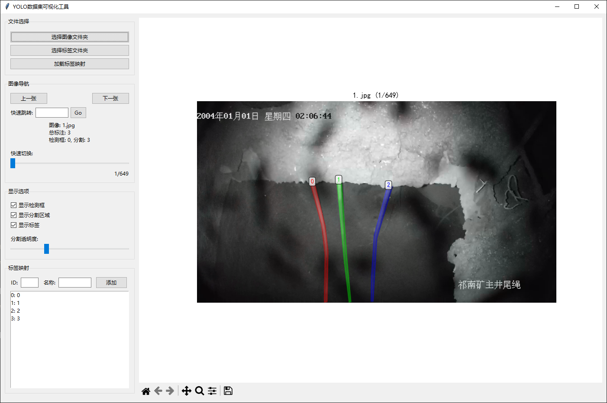

# YOLO 数据集可视化工具

一个用于可视化YOLO 格式数据集的桌面应用程序，支持图像预览、标签编辑和数据集统计等功能，支持目标检测、分割可视化。




## 快速开始

1. 安装依赖：

   ```bash
   pip install -r requirements.txt
   ```

2. 运行应用：

   ```bash
    python main.py
    ```
